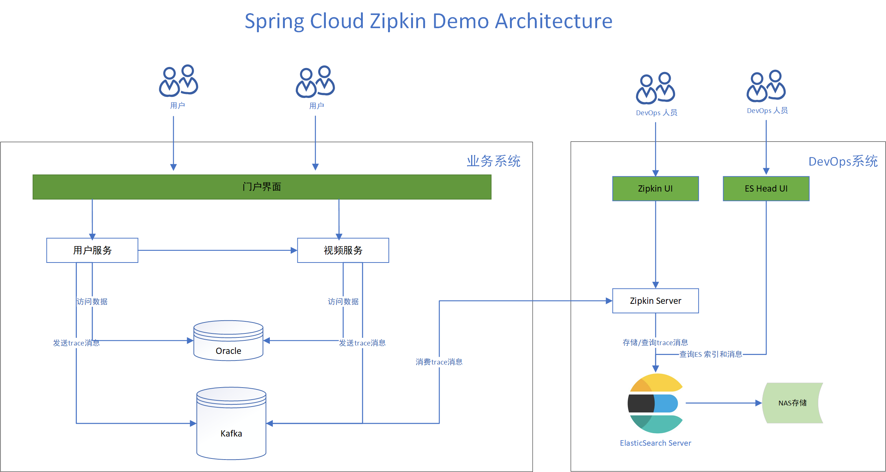

#### Spring Cloud Zipkin Demo

本例使用基于spring cloud, 使用zipkin 对微服务请求进行链路追踪

##### 系统框架图



##### Install ElasticSearch (MacOS)


```
$ wget https://artifacts.elastic.co/downloads/elasticsearch/elasticsearch-7.2.0-darwin-x86_64.tar.gz
$ tar zxvf elasticsearch-7.2.0-darwin-x86_64.tar.gz
$ ./elasticsearch -d
```

修改支持跨域访问:
```
$ vi config/elasticsearch.yml

add the following config:
http.cors.enabled: true
http.cors.allow-origin: "*"
```

##### Install ElasticSearch Head

安装elasticsearch head 可以用来根据ui 查询 结果
可访问github at https://github.com/mobz/elasticsearch-head

```
$ git clone git://github.com/mobz/elasticsearch-head.git
$ cd elasticsearch-head
$ npm install
$ npm run start
```

Access http://localhost:9100 and input http://localhost:9200 to connect elasticsearch server.


##### Install Kafka

```
$ wget http://mirror.bit.edu.cn/apache/kafka/2.2.0/kafka_2.12-2.2.0.tgz
$ tar -xzf kafka_2.12-2.2.0.tgz
$ cd kafka_2.12-2.2.0

$ nohup bin/zookeeper-server-start.sh config/zookeeper.properties &
$ nohup bin/kafka-server-start.sh config/server.properties &
```

##### Install and Start Applications

```
$ git clone git@github.com:robinyeeh/spring-cloud-zipkin-demo.git
$ cd spring-cloud-zipkin-demo/mbp-base
$ mvn clean install

$ cd ..
$ mvn clean package

$ mkdir -p /opt/app/mbp
$ mkdir -p /opt/app/mbp/logs
$ cp spring-cloud-zipkin-demo/mbp-zipkin-server/target/mbp-zipkin-server-1.0.0.tar.gz /opt/app/mbp/
$ cp spring-cloud-zipkin-demo/mbp-registry/target/mbp-registry-1.0.0.tar.gz /opt/app/mbp/
$ cp spring-cloud-zipkin-demo/mbp-video/target/mbp-video-1.0.0.tar.gz /opt/app/mbp/
$ cp spring-cloud-zipkin-demo/mbp-user/target/mbp-user-1.0.0.tar.gz /opt/app/mbp/

$ cd /opt/app/mbp/
$ tar zxvf mbp-zipkin-server-1.0.0.tar.gz
$ tar zxvf mbp-registry-1.0.0.tar.gz
$ tar zxvf mbp-video-1.0.0.tar.gz
$ tar zxvf mbp-user-1.0.0.tar.gz

Start Zipkin Server:
$ cd /opt/app/mbp/zipkin
$ ./service.sh start default

Start Registry Service:
$ cd /opt/app/mbp/registry
$ ./service.sh start default

Start Video Service:
$ cd /opt/app/mbp/video
$ ./service.sh start default

Start User Service:
$ cd /opt/app/mbp/user
$ ./service.sh start default
```

##### Create DB and Import SQL (MYSQL)

```
# create database zipkin_demo;

$ mysql -u root -p zipkin_demo < ./mbp-video/sql/mysql/mbp_video.sql
$ mysql -u root -p zipkin_demo < ./mbp-video/sql/mysql/mbp_user.sql
```

##### Check Zipkin Flow

```
$ curl -X GET http://127.0.0.1:9002/videos/1

access http://127.0.0.1:9411/zipkin/ to see span

If no data, access http://localhost:9100/ to see if trace messages stored in ES.

If no data, use Kafka Tool to see if traces messages goes into kafka server. Download Kafka Tools from http://www.kafkatool.com/
```

##### Zipkin Server from Github

如果直接使用官方提供的zipkin server, 可参照一下操作

```
$ curl -sSL https://zipkin.io/quickstart.sh | bash -s
$ java -jar zipkin.jar
```

KAFKA_BOOTSTRAP_SERVERS=localhost:9092 STORAGE_TYPE=elasticsearch ES_HOSTS=127.0.0.1:9200 java -jar zipkin.jar

